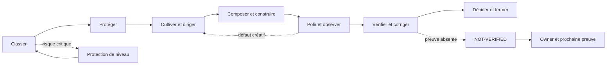

# Flux de décision V1

Le flux suivant est une vue de lecture, pas une route supplémentaire :

En texte : **classer et protéger le run, cultiver et diriger la décision, composer et construire l’artefact, polir et observer le rendu, vérifier et corriger ce qui est observable, puis décider et fermer avec ses limites**. Un risque critique ramène au classement (reclassification) ; une preuve absente reste `NOT-VERIFIED`, avec owner et prochaine preuve. La boucle créative élève le résultat ; la boucle de gouvernance protège le risque, la preuve et la vérité de ce qui peut être affirmé.

Charger `DIRECTION/START` avant un build, une modification, une vérification, une action externe ou une décision persistante. Charger les routes approfondies uniquement si elles peuvent modifier une décision, un artefact, une preuve, une limite ou la prochaine action.

Pour composer plusieurs capacités selon un résultat recherché — direction, beauté située, créativité, usage, preuve, vitesse ou système — consulter `ORCHESTRATION_MAP.md` dans la carte officielle du package. Cette carte complète le flux sans créer de route supplémentaire.

